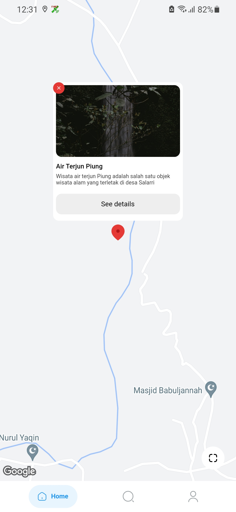
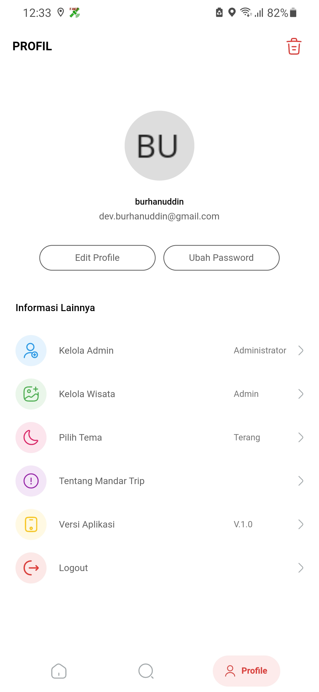
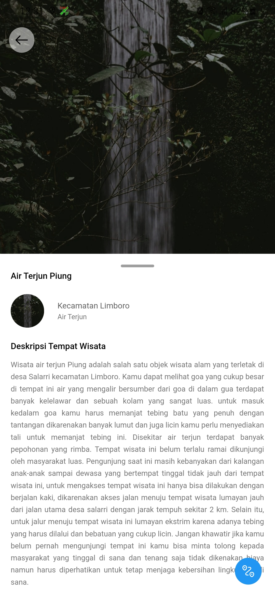
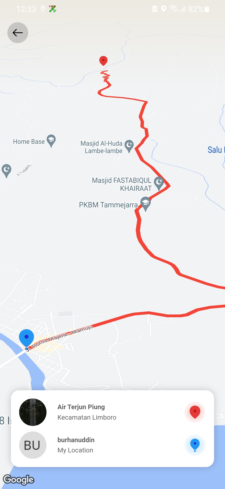

# Mandar Trip
IMPLEMENTASI FRAMEWORK FLUTTER SISTEM INFORMASI PARIWISATA DI KABUPATEN POLEWALI MANDAR DENGAN METODE LOCATION BASED SERVICE (LBS)

## Dibuat Dengan 
- Flutter 2.10.5
- Menggunakan Satate Management <B>GetX</B>
- API google maps <b>Direction API</b> and <b>Maps SDK For Android</b>
- Firebase

## Role In Aplikasi
- Administrator 
- Editor/Admin 
- Visitor/Pengunjung

## Fitur In Aplikasi
- Include ganti password, reset password. email verification, edit profile, delete account.
- Include kelola admin (tambah admin), kelola wisata (tambah, edit, dan delete wisata)
- Include map, marker dan Rute Wisata

## Require
- Api key google maps
    - Maps SDK For Android
    - Direction API
- Flutter SDK
- JDK 8 or 11
- Android Studio and Visual Studio Code

## Output Tampilan Aplikasi
 <br>
 

## How To Run Project
- Clone Repo https://github.com/04burhanuddin/Mandar-Trip.git
- Open in your Favorite Editor, Iam Using <b>Visual Studio Code</b>
- Open terminal, in directory projrct run ```flutter pub get```
- Konfigurasi Firebase, recomended gunakan Firebase CLI
- Finally run ```flutter run```